# Execution Plan

## Detailed Analysis Summary

### Change Impact Assessment
- **User-facing changes**: Yes - Distinct visualizations depending on IAM roles.
- **Structural changes**: Yes - Establishing a three-tier Lakehouse S3 storage architecture.
- **Data model changes**: Yes - Synthetic PII generation joined with 40-year Stock Data fact table in Apache Iceberg.
- **API/Service changes**: Yes - New Glue Jobs, Athena Queries, and Lake Formation Tags.
- **NFR impact**: Yes - Strict Least Privilege IAM, LF-Tags, RLS, CLS, Dynamic Data Masking, Infrastructure as Code via Terraform.

### Risk Assessment
- **Risk Level**: High
- **Rollback Complexity**: Moderate (Given IaC, it can be destroyed via Terraform, but data/state could be complex).
- **Testing Complexity**: Complex (Requires assuming roles in AWS to validate RLS/CLS and producing visual PBT-backed evidence).

## Workflow Visualization

```mermaid
flowchart TD
    Start(["User Request"])
    
    subgraph INCEPTION["🔵 INCEPTION PHASE"]
        WD["Workspace Detection (COMPLETED)"]
        RE["Reverse Engineering (SKIP)"]
        RA["Requirements Analysis (COMPLETED)"]
        US["User Stories (COMPLETED)"]
        WP["Workflow Planning (COMPLETED)"]
        AD["Application Design (EXECUTE)"]
        UP["Units Planning (EXECUTE)"]
        UG["Units Generation (EXECUTE)"]
    end
    
    subgraph CONSTRUCTION["🟢 CONSTRUCTION PHASE"]
        FD["Functional Design (EXECUTE)"]
        NFRA["NFR Requirements (EXECUTE)"]
        NFRD["NFR Design (EXECUTE)"]
        ID["Infrastructure Design (EXECUTE)"]
        CG["Code Generation (EXECUTE)"]
        BT["Build and Test (EXECUTE)"]
    end
    
    subgraph OPERATIONS["🟡 OPERATIONS PHASE"]
        OPS["Operations (PLACEHOLDER)"]
    end
    
    Start --> WD
    WD -.-> RE
    WD --> RA
    RE --> RA
    RA --> US
    US --> WP
    WP --> AD
    AD --> UP
    UP --> UG
    UG --> FD
    FD --> NFRA
    NFRA --> NFRD
    NFRD --> ID
    ID --> CG
    CG --> BT
    BT -.-> OPS
    BT --> End(["Complete"])
    
    style WD fill:#4CAF50,stroke:#1B5E20,stroke-width:3px,color:#fff
    style RE fill:#BDBDBD,stroke:#424242,stroke-width:2px,stroke-dasharray: 5 5,color:#000
    style RA fill:#4CAF50,stroke:#1B5E20,stroke-width:3px,color:#fff
    style US fill:#4CAF50,stroke:#1B5E20,stroke-width:3px,color:#fff
    style WP fill:#4CAF50,stroke:#1B5E20,stroke-width:3px,color:#fff
    style AD fill:#FFA726,stroke:#E65100,stroke-width:3px,stroke-dasharray: 5 5,color:#000
    style UP fill:#FFA726,stroke:#E65100,stroke-width:3px,stroke-dasharray: 5 5,color:#000
    style UG fill:#FFA726,stroke:#E65100,stroke-width:3px,stroke-dasharray: 5 5,color:#000

    style FD fill:#FFA726,stroke:#E65100,stroke-width:3px,stroke-dasharray: 5 5,color:#000
    style NFRA fill:#FFA726,stroke:#E65100,stroke-width:3px,stroke-dasharray: 5 5,color:#000
    style NFRD fill:#FFA726,stroke:#E65100,stroke-width:3px,stroke-dasharray: 5 5,color:#000
    style ID fill:#FFA726,stroke:#E65100,stroke-width:3px,stroke-dasharray: 5 5,color:#000
    style CG fill:#FFA726,stroke:#E65100,stroke-width:3px,color:#000
    style BT fill:#FFA726,stroke:#E65100,stroke-width:3px,color:#000
    style OPS fill:#BDBDBD,stroke:#424242,stroke-width:2px,stroke-dasharray: 5 5,color:#000

    style INCEPTION fill:#BBDEFB,stroke:#1565C0,stroke-width:3px, color:#000
    style CONSTRUCTION fill:#C8E6C9,stroke:#2E7D32,stroke-width:3px, color:#000
    style OPERATIONS fill:#FFF59D,stroke:#F57F17,stroke-width:3px, color:#000
    style Start fill:#CE93D8,stroke:#6A1B9A,stroke-width:3px,color:#000
    style End fill:#CE93D8,stroke:#6A1B9A,stroke-width:3px,color:#000
    
    linkStyle default stroke:#333,stroke-width:2px
```

## Phases to Execute

### 🔵 INCEPTION PHASE
- [x] Workspace Detection (COMPLETED)
- [x] Reverse Engineering (SKIPPED)
- [x] Requirements Elaboration (COMPLETED)
- [x] User Stories (COMPLETED)
- [x] Execution Plan (IN PROGRESS)
- [ ] Application Design - EXECUTE
  - **Rationale**: Service boundaries between Data Generation, S3/Glue processing, and Lake Formation assignment must be rigorously defined before implementation.
- [ ] Units Planning / Generation - EXECUTE
  - **Rationale**: The project clearly spans a front-to-back pipeline. Grouping the work into units (e.g., Data Generation, Terraform Infrastructure, Glue PySpark) enables clean mapping for the Construction phase execution.

### 🟢 CONSTRUCTION PHASE
- [ ] Functional Design - EXECUTE
  - **Rationale**: Required for the granular design of PySpark DataFrame manipulations and data masking behaviors.
- [ ] NFR Requirements - EXECUTE
  - **Rationale**: Mandatory for mapping Security-01 to Security-15 constraints explicitly into Terraform configuration files.
- [ ] NFR Design - EXECUTE
  - **Rationale**: Required to incorporate the required security architecture and Property-Based Testing properties into the physical blueprints.
- [ ] Infrastructure Design - EXECUTE
  - **Rationale**: The core of this deployment relies on complex AWS service mappings via Terraform.
- [ ] Code Generation - EXECUTE (ALWAYS)
  - **Rationale**: Implementation planning and code generation needed.
- [ ] Build and Test - EXECUTE (ALWAYS)
  - **Rationale**: Necessary to validate functionality via Athena screenshot proofs and the CI/CD MkDocs deployment.

### 🟡 OPERATIONS PHASE
- [ ] Operations - PLACEHOLDER
  - **Rationale**: Future deployment and monitoring workflows

## Estimated Timeline
- **Total Phases**: 12 (including completed and conditional)
- **Estimated Duration**: 3-4 coding sessions

## Success Criteria
- **Primary Goal**: Fully deployed centralized data lakehouse on AWS.
- **Key Deliverables**: Python data generator, Terraform IaC, PySpark Glue scripts, GitHub Actions workflows, MkDocs site.
- **Quality Gates**: Property-Based Tests pass locally, Terraform `apply` succeeds, Athena queries return filtered data based strictly on IAM role.
